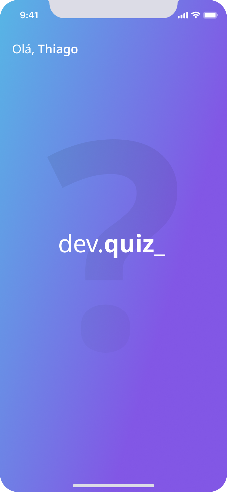
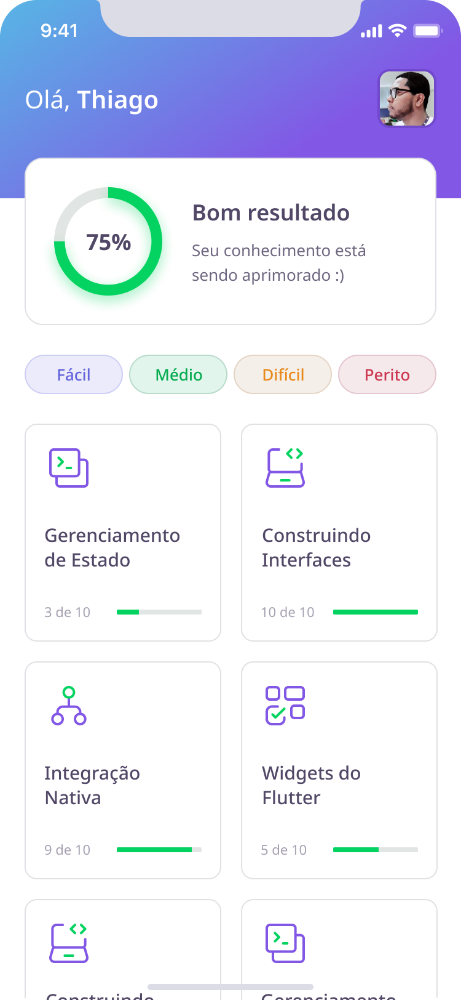

# DevQuiz

A Flutter app developed over 5 days during Rocketseat's NLW # 5 week that aims to help programmers learn something new through questionnaires

## Project Status

This project is just a personal showcase, done with de aim of  register what i have stidied, and show my skills. It may receives improvements in the fufute.

## Project Screen Shots

| Splash Screen                                                                      | Home Screen                                  | Challenge Screen                                    |
| ---------------------------------------------------------------------------------- | -------------------------------------------- | --------------------------------------------------- |
|  |  |  |

| Question Right Screen                         | Question Wrong Screen                          | Result Screen                                     |
| --------------------------------------------- | ---------------------------------------------- | ------------------------------------------------- |
|  |  |  |

## what's in this project

## Installation and Setup Instructions

#### Example:

Clone down this repository. You will need `Flutter` and `Dart` installed globally on your machine.  

Installation:

`flutter pub get install` on the project root.  

To Run the android application:  

`flutter run -d <device or emulator id>`  

To build a android release:

`flutter build apk` the package will be generated on **./build/app/outputs/flutter-apk/app-release.apk**

## Reflection

- What was the context for this project? (ie: was this a side project? was this for Turing? was this for an experiment?)
- What did you set out to build?
- Why was this project challenging and therefore a really good learning experience?
- What were some unexpected obstacles?
- What tools did you use to implement this project?
  - This might seem obvious because you are IN this codebase, but to all other humans now is the time to talk about why you chose webpack instead of create react app, or D3, or vanilla JS instead of a framework etc. Brag about your choices and justify them here.  

#### Example:

This was a 3 week long project built during my third module at Turing School of Software and Design. Project goals included using technologies learned up until this point and familiarizing myself with documentation for new features.  

Originally I wanted to build an application that allowed users to pull data from the Twitter API based on what they were interested in, such as 'most tagged users'. I started this process by using the `create-react-app` boilerplate, then adding `react-router-4.0` and `redux`.  

One of the main challenges I ran into was Authentication. This lead me to spend a few days on a research spike into OAuth, Auth0, and two-factor authentication using Firebase or other third parties. Due to project time constraints, I had to table authentication and focus more on data visualization from parts of the API that weren't restricted to authenticated users.

At the end of the day, the technologies implemented in this project are React, React-Router 4.0, Redux, LoDash, D3, and a significant amount of VanillaJS, JSX, and CSS. I chose to use the `create-react-app` boilerplate to minimize initial setup and invest more time in diving into weird technological rabbit holes. In the next iteration I plan on handrolling a `webpack.config.js` file to more fully understand the build process.