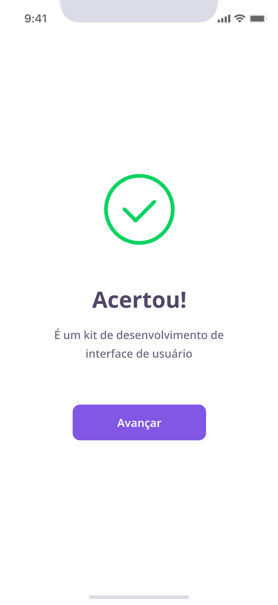
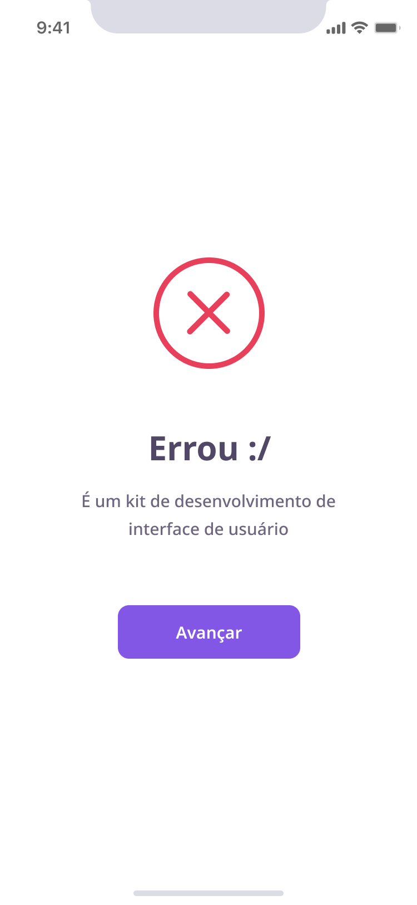

# DevQuiz

A Flutter app developed over 5 days during Rocketseat's NLW # 5 week that aims to help programmers learn something new through questionnaires

## Project Status

This project is just a personal showcase, done with de aim of  register what i have studied, and show my skills. It may receives improvements in the future.

## Project Screen Shots

| Splash Screen                                                                | Home Screen                             | Home Screen(zero data)                             |
| ---------------------------------------------------------------------------- | --------------------------------------- | -------------------------------------------------- |
|  |  | .png) |

## 

| Rigth Answer Screen                      | Wrong Answer Screen                       | Result Screen                               |
| ---------------------------------------- | ----------------------------------------- | ------------------------------------------- |
|  |  |  |

## what's in this project

## Installation and Setup Instructions

#### Example:

Clone down this repository. You will need `Flutter` and `Dart` installed globally on your machine.  

Installation:

`flutter pub get install` on the project root.  

To Run the android application:  

`flutter run -d <device or emulator id>`  

To build a android release:

`flutter build apk` the package will be generated on **./build/app/outputs/flutter-apk/app-release.apk**

## Reflection

- What was the context for this project? (ie: was this a side project? was this for Turing? was this for an experiment?)
- What did you set out to build?
- Why was this project challenging and therefore a really good learning experience?
- What were some unexpected obstacles?
- What tools did you use to implement this project?
  - This might seem obvious because you are IN this codebase, but to all other humans now is the time to talk about why you chose webpack instead of create react app, or D3, or vanilla JS instead of a framework etc. Brag about your choices and justify them here.  